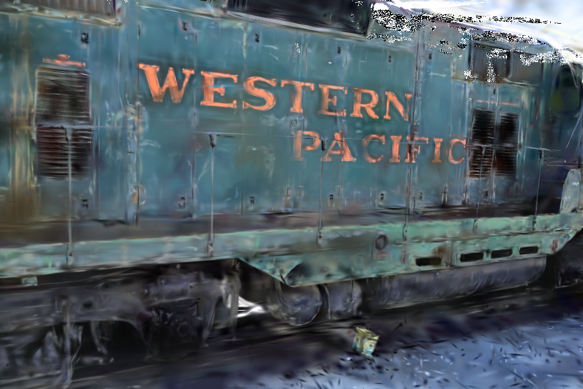
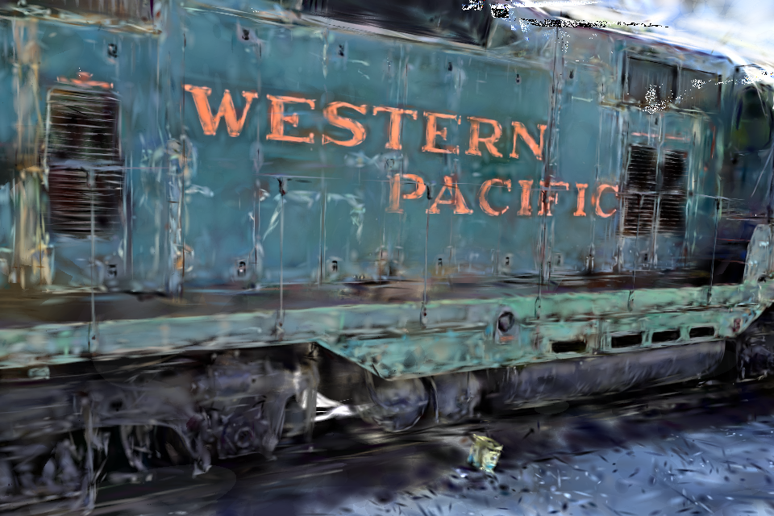
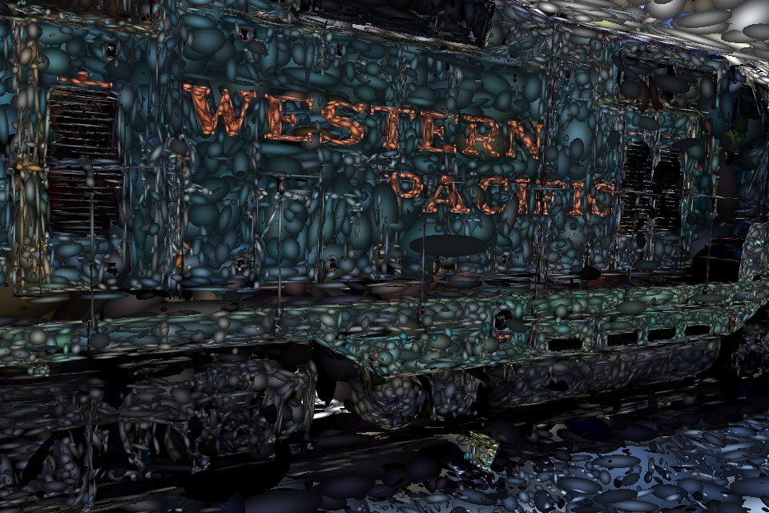
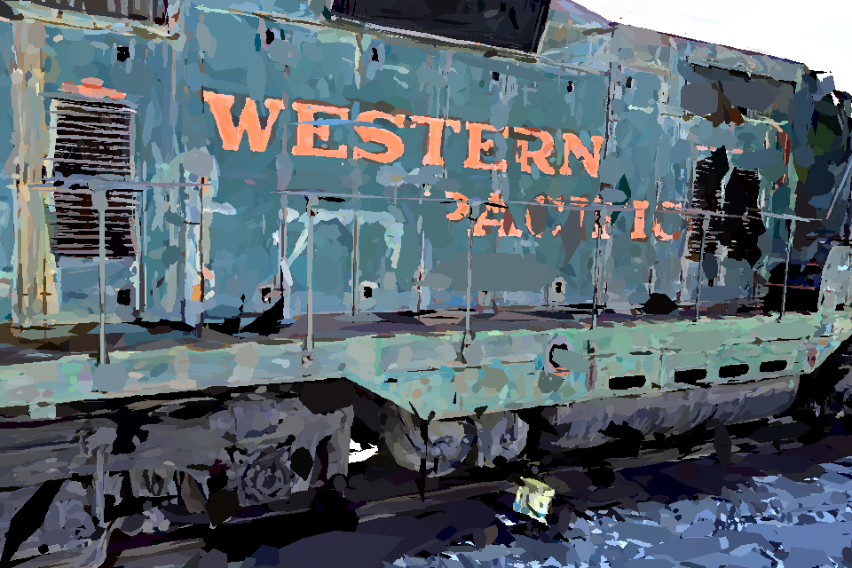

# WebGPU Gaussian Ray Tracer
A non-official implementation of the rendering part of the paper "3D Gaussian Ray Tracing: Fast Tracing of Particle Scenes" on the web.

## How to run
### Requirements
* Node.js (https://nodejs.org/en)
* Rust (https://www.rust-lang.org/tools/install)
* WebGPU supporting browsers (almost browsers)
* Trained data from vanilla Gaussian splatting (https://repo-sam.inria.fr/fungraph/3d-gaussian-splatting/datasets/pretrained/models.zip)

### Build and Serve
```
# First build(including compile):
npm install
npm run build


# For just compile:
npm run compile


# serve
python -m http.server 3000
```

## Introduction
* To the best of my knowledge, this is the first open-source implementation of rendering for Gaussian ray tracing.

* There are two groups of ray tracing programs utilizing GPUs. The first group employs modern GPU-accelerated ray tracing APIs, such as OptiX, DXR, or Vulkan Ray Tracing. The second group consists of native implementations running on GPGPU using frameworks like CUDA or compute shaders. The first group is more efficient than the second due to the utilization of dedicated RT cores. However, it is limited to specific graphics cards, such as GeForce RTX and Radeon RX, whereas the second group can run on any graphics card. This project belongs to the second group, as there are currently no methods available to utilize RT cores on the web.

* Unfortunately, the Gaussian ray tracer does **not** fully accommodate data trained on vanilla Gaussian splatting, as mentioned in the paper. Therefore, I do not have any proper data for this project because the authors of the paper have not published the data trained on their model. Consequently, I had no choice but to run the example with vanilla Gaussian splatting data, and the results were reasonably satisfactory.

## Examples
*With alpha_min == 0.01*


*With alpha_min == 0.1*


*With alpha_min == 0.2 & hit_array_size == 1 & T_min == 0.99*


*Visualizing bvh scene mode with alpha_min == 0.2*


*Visualizing call count for anyhit shader with alpha_min == 0.1 & hit_array_size == 6*


## Limitations
[*Memory issues*]  
Generally, a Gaussian point cloud with spherical harmonics of degree 3 requires a large amount of CPU memory (for file loading) and GPU memory, leading to potential memory issues. Additionally, Gaussian ray tracing demands even more GPU memory for BVH scene construction. Therefore, when dealing with scenes containing a large number of Gaussian points, loading them may be failed. For standard data trained using vanilla Gaussian splatting, only relatively small datasets (e.g., data/train/point_cloud/iteration_7000/point_cloud.ply) would be successfully loaded.

[*Performance issues*]  
The authors of the paper claim that their method achieves real-time performance. However, in this implementation, the frame rate is below 1 fps under settings similar to those described in the paper. Possible reasons for this discrepancy include: (1) this implementation does not utilize RT core acceleration, and (2) the tested graphics card is an RTX 4090, rather than the RTX 6000 Ada mentioned in the paper. Recently, there have been numerous ray tracing applications using GPGPU, regardless RT core availability, which demonstrate sufficient performance. Therefore, in my opinion, there seems to be some issues with asserting that the method in the paper achieves real-time performance, especially considering the performance on the high-end RTX 4090. Anyway, to ensure a more convenient experience in this implementation, you should adjust rendering parameters such as the render target resolution and alpha_min. Decreasing alpha_min reduces the memory required for BVH construction and leads to fewer calls to the AnyHit shader, the main bottleneck in the rendering pipeline. **For the best experience**, I recommend setting alpha_min to 0.2 and enabling debugMode to 1, which visualizes the raw geometries (icosahedrons) used to construct the BVH.


## Reference
1. Vanilla Gaussian Splatting - https://github.com/graphdeco-inria/gaussian-splatting  
2. Gaussian Ray Tracing - https://gaussiantracer.github.io/
3. WebRTX - https://github.com/codedhead/webrtx/tree/master
4. DXR spec - https://microsoft.github.io/DirectX-Specs/d3d/Raytracing.html
5. Vulkan correspondence to DXR - https://docs.vulkan.org/guide/latest/high_level_shader_language_comparison.html

[*Notes on 3, 4, 5*]  
This code is based on the WebRTX framework, which emulates the Vulkan ray tracing API and its shader interfaces—such as ray generation, closest-hit, any-hit, and miss shaders—using glslang to convert GLSL into WGSL (WebGPU Shader Language). However, the framework only implements the core functionality of ray tracing, leaving many features as a work in progress. As a result, I had to add additional features to support the Gaussian ray tracer.
If you want to extend the framework for specific applications, you need to be familiar with modern ray tracing APIs standardized by NVIDIA’s RTX and Microsoft’s DXR. Although the WebRTX framework emulates Vulkan ray tracing rather than DXR, the detailed DXR specifications are still very helpful.

## Plans
At the beginning of this project, I intended to create samples that showcased reflections, shadows, fisheye lenses, and more. However, after implementing and testing the basic method, I recognized that significantly improving performance is an urgent issue that needs to be addressed. Therefore, I am considering re-implementing Gaussian ray tracing using DXR or Vulkan ray tracing to take advantage of RT cores. Also, I am considering the implementation of the traing part of the paper for the obtaining the data. However, these plans currently hold a low priority on my overall to-do list, so it's uncertain when they will be executed. 